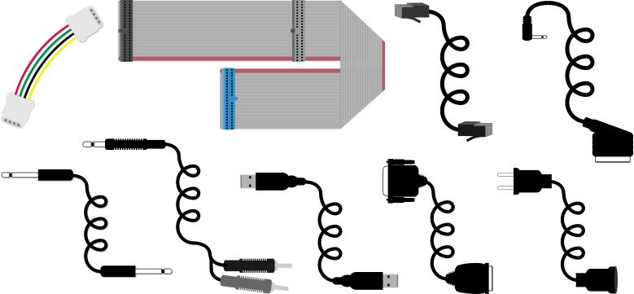

    ADAPTER
    
-Intent

    * Convert the interface of a class into another interface clients expect. 
      Adapter lets classes work together that couldn't otherwise because of 
      incompatible interfaces.
    * Wrap an existing class with a new interface.

-Problem

    An "off the shelf" component offers compelling functionality that you would like 
    to reuse, but its "view of the world" is not compatible with the philosophy and
    architecture of the system currently being developed.
    
-Solution

    Reuse has always been painful and elusive. One reason has been the tribulation of
    designing something new, while reusing something old. There is always something 
    not quite right between the old and the new. It may be physical dimensions or 
    misalignment. It may be timing or synchronization. It may be unfortunate assumptions
    or competing standards.
    
    It is like the problem of inserting a new three-prong electrical plug in an old 
    two-prong wall outlet – some kind of adapter or intermediary is necessary.
    
;
    
    
    Adapter is about creating an intermediary abstraction that translates, or maps,
    the old component to the new system. Clients call methods on the Adapter object
    which redirects them into calls to the legacy component. This strategy can be 
    implemented either with inheritance or with aggregation.
    
    Adapter functions as a wrapper or modifier of an existing class. It provides a different 
    or translated view of that class.
