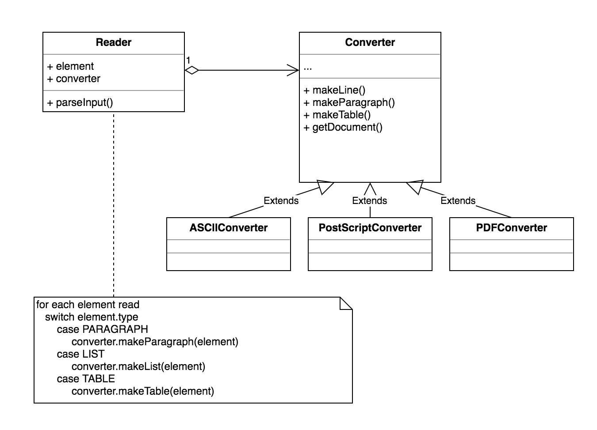

BUILDER
-------
   
-Intent

    * Separate the construction of a complex object from its representation so that
      the same construction process can create different representations.
    * Parse a complex representation, create one of several targets.  
    
-Problem

   An application needs to create the elements of a complex aggregate. 
   The specification for the aggregate exists on secondary storage and one of many 
   representations needs to be built in primary storage.     
    
-Solution

   Separate the algorithm for interpreting (i.e. reading and parsing) a stored 
   persistence mechanism (e.g. RTF files) from the algorithm for building and 
   representing one of many target products (e.g. ASCII, TeX, text widget). 
   The focus/distinction is on creating complex aggregates.
    
   The "director" invokes "builder" services as it interprets the external format. 
   The "builder" creates part of the complex object each time it is called and
   maintains all intermediate state. When the product is finished, the client 
   retrieves the result from the "builder".
    
   Affords finer control over the construction process. Unlike creational patterns
   that construct products in one shot, the Builder pattern constructs the product 
   step by step under the control of the "director".   

UML Diagram  
----------- 
   

    