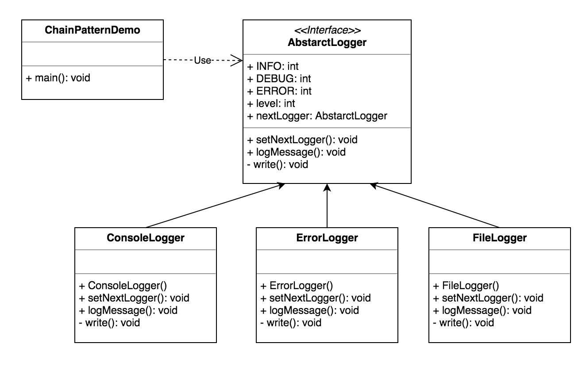

CHAIN OF RESPONSIBILITY
-----------------------
   
-Intent

    * Avoid couplingthe sender of a request to its receiver by giving more than one 
      object a chance to handle the request. Chain the receiving objects and pass the
      request along the chain until an object handles it.
    * Launch-and-leave request with a single processing pipeline that contains many
      possible handlers.
    * An object-oriented linked list with recursive traversal.
    
-Problem
    
   There is a potentially variable number of 'handler' or 'processing element' or 'node'
   objects, and a stream of requests that must be handled. Need to efficiently process
   the request without hard-wiring handler relationships and precedence, or request-to-
   handler mappings.

-Solution

   Encapsulate the processing elements inside a 'pipeline' abstraction; and have
   clients 'launch and leave' their request at the entrance to the pipeline.
    
   The pattern chains the receiving objects together, and then presses any request
   messages from object to object until it reaches an object capable of handling the 
   message. Thr number and type of handler objects isn't known a priori, they can be
   configured dynamically. The chaining mechanism uses recursive composition to allow
   an unlimited number of handlers to be linked.
    
   Chain of Responsibility simplifies object interconnections. Instead of senders and
   receivers maintaining references to all candidate receivers, each sender keeps
   a single reference to the head of the chain, and each receiver keeps a single 
   reference  to its immediate successor in the chain.
    
   Do not use Chain of Responsibility when each request is only handled by 
   one handler, or, when the client object knows which service object should
   handle the request. 
   
   
UML Diagram
-----------

        