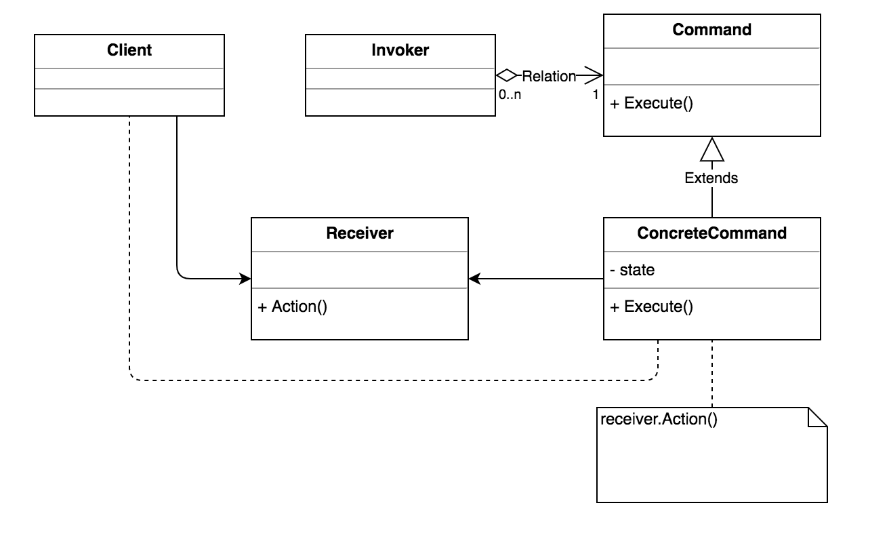

COMMAND
-------
    
-Intent

    *  Encapsulate a request as an object, thereby letting you parametrize clients 
       with different requests, queue or log requests, and support undoable operations.
    *  Promote "invocation of a method on an object" to full object status
    
-Problem

   Need to issue requests to objects without knowing anything about the operation
   being requested or the receiver of the request. 
     
-Solution

   Command decouples the object that invokes the operation from the one that knows
   how to perform it. To achieve this separation, the designer creates an abstract
   base class that maps a receiver (an object) with an action (a pointer to a member
   function). The base class contains an execute() method that simply calls 
   the action on the receiver.
     
   All clients of Command objects treat each object as a "black box" by simply 
   invoking the object's virtual execute() method whenever the client requires 
   the object's "service".
     
   A Command class holds some subset of the following: an object, a method to be 
   applied to the object, and the arguments to be passed when the method is applied.
   The Command's "execute" method then causes the pieces to come together.   
   
   
UML Diagram
-----------
       