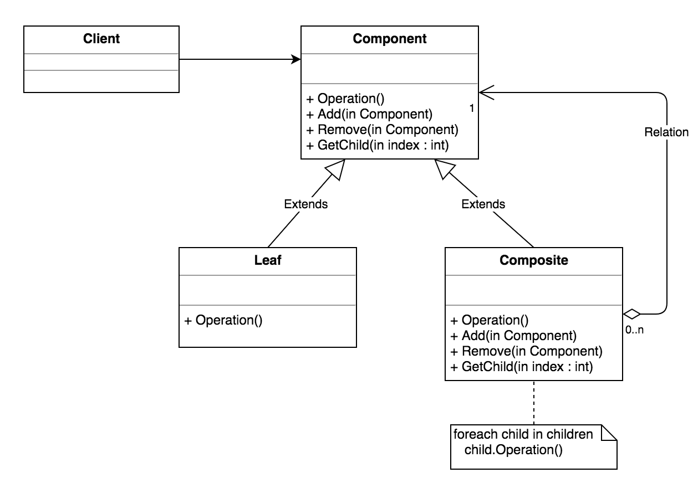

COMPOSITE
---------
    
-Intent

    * Compose objects into structures to represent whole-part hierarchies.
    * Composite lets clients treat individual objects and compositions of objects
      uninformly.
    * Recursive composition.
    * 'Directories contain entries, each of which could be a directory.' 1-to-many
      'has a' up the 'is a' hierarchy.  
    
-Problem

   Application needs to manipulate a hierarchical collection of 'primitive' and
   'composite' objects. Processing of a primitive object is handled one way, and
   processing of a composite object is handled differently. Having to query the 
   'type' of each object before attempting to process it is not desirable. 
    
-Solution

   Define an abstract base class that specifies the behavior that needs to be exercised
   uniformly across all primitive and composite objects. Subclass and Primitive and
   Composite classes off of the Component class. Each Composite object 'couples' itself
   only to the abstract type Component as it manages its 'children'.
    
   Use this pattern whenever you have 'composite that contain components, each of
   which could be a composite'.
    
   Child management methods [e.g. addChild(), removeChild()] should normally be
   defined in the Composite class. Unfortunately, the desire to treat Primitives
   and Composites uniformly requires that these methods be moved to the abstract 
   Component class. /*See the 'Opinions' section below for a discussion of 'safety'
   versus 'transparency' issues.*/ where is this section?
   
UML Diagram
-----------

   
       