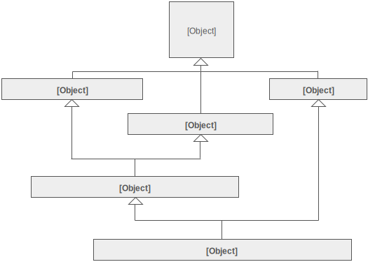
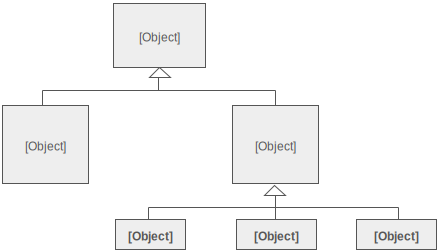

DECORATOR
---------
    
-Intent

    * Attach additional responsibilities to an object dynamically. Decorators provide
      a flexible alternative to subclassing for extending functionality.
    * Client-specified embellishment of a core object by recursively wrapping it.
    * Wrapping a gift, putting it in a box, and wrapping the box.

-Problem

   You want to add behavior or state to individual objects at run-time. 
   Inheritance is not feasible because it is static and applies to an entire class.
    
-Solution

   Suppose you are working on a user interface toolkit and you wish to support 
   adding borders and scroll bars to windows. You could define an inheritance 
   hierarchy like ...
    


   But the Decorator pattern suggests giving the client the ability to specify 
   whatever combination of "features" is desired.

```
Widget* aWidget = new BorderDecorator(
  new HorizontalScrollBarDecorator(
    new VerticalScrollBarDecorator(
      new Window( 80, 24 ))));
aWidget->draw();
```    

   This flexibility can be achieved with the following design
    


   Another example of cascading (or chaining) features together to produce a custom
   object might look like ...
    
```$xslt
Stream* aStream = new CompressingStream(
  new ASCII7Stream(
    new FileStream("fileName.dat")));
aStream->putString( "Hello world" );
```    

   The solution to this class of problems involves encapsulating the original object
   inside an abstract wrapper interface. Both the decorator objects and the core 
   object inherit from this abstract interface. The interface uses recursive composition
   to allow an unlimited number of decorator "layers" to be added to each core object.
    
   Note that this pattern allows responsibilities to be added to an object, not methods
   to an object's interface. The interface presented to the client must remain constant
   as successive layers are specified.
    
   Also note that the core object's identity has now been "hidden" inside of a decorator
   object. Trying to access the core object directly is now a problem.
    
    
UML Diagram
-----------
    
        


    
    
    
    
  
    