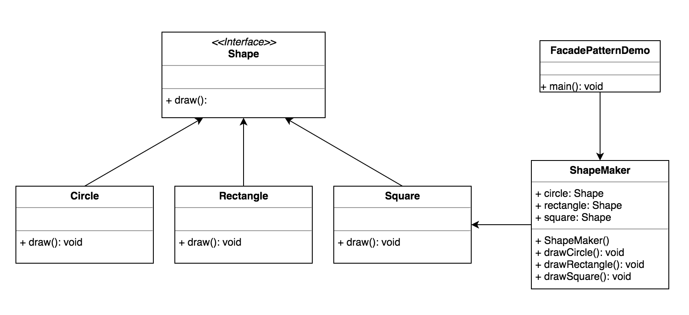

FACADE PATTERN
--------------

-Intent

    * Provide a unified interface to a set of interfaces in a subsystem. Facade
      defines a higher-level interface that makes the subystem easiet to use.
    * Wrap a complicated subsystem with a simpler interface.
    
-Problem

   A segment of the client community needs a simplified interface to the overall
   functionality of a complex subsystem.
    
-Solution

   Facade discusses encapsulating a complex subsystem within a single interface
   object. This reduce the learning curve necessary to successfully leverage the
   subsystem. It also promotes decoupling the subsystem form its potentially many
   clients. On the other hand, if the Facade is the only access point for the subsystem,
   it will limit the feature and  flexibility that 'power users' may need.
    
   THe Facade object should be a fairly simply advocate or facilitator. It should 
   not become an all-knowing oracle or 'god' object.
   
UML Diagram
-----------

  
  