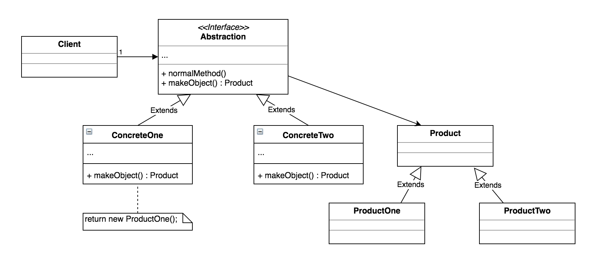

FACTORY METHOD
--------------
   
 - Intent

    *  Define an interface for creating an object, but let subclasses decide which
       class to instantiate. Factory Method lets a class defer instantiation to
       subclasses.
       
    *  Defining a 'virtual' constructor.   
   
 - Problem
 
    A framework needs to standardize the architectural model for range of applications,
    but allow for individual applications to define their own domain object and provide
    for their instantiation.
    
 - Solution
    
    Factory Method is to creating as Template Method is to implementing an algorithm.
    A superclass specifies all standard and generic behaviour, and then delegates the
    creation details to subclasses that are supplied by the client.
    
    Factory Method makes a design more customizable and only a little more complicated
    Other design patterns require new classes, whereas Factory Method only requires a
    new operation.
    
    People often use Factory Method as the standard way to create objects; but it isn't
    necessary if: the class that's instantiated never changes, or instantiation takes
    place in an operation that subclasses can easily override.
        
    Factory Method is similar to Abstract Factory but without the emphasis on families.
    Factory Methods are routinely specified by an architectural frameworks, and then
    implemented by the user of the framework.

UML Diagram
-----------
   
       
 
    
 
 
 
   
