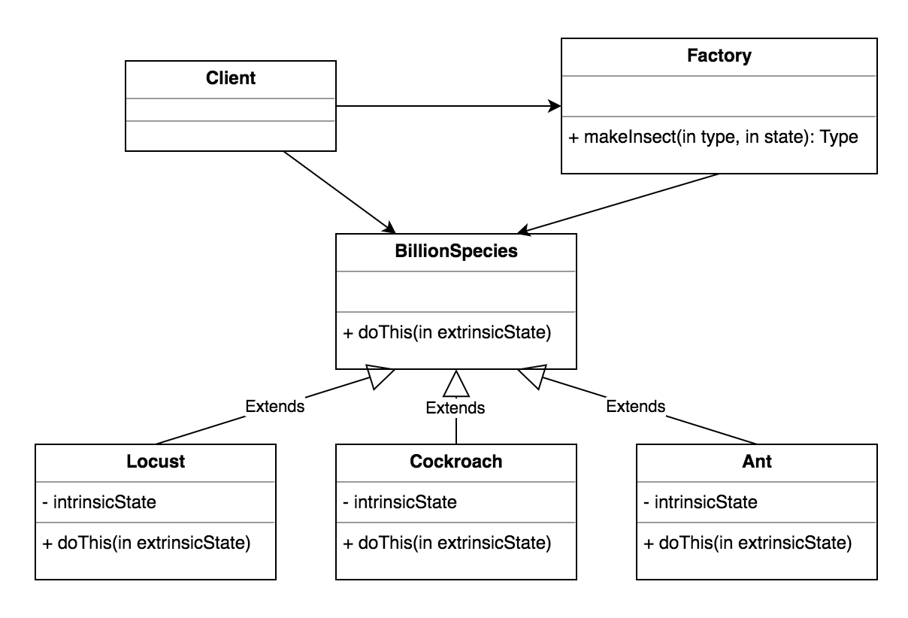

FLYWEIGHT
---------

-Intent

    * Use sharing to support large numbers of fine-grained objects efficiently.
    * The Motif GUI strategy of replacing heavy-weight widgets with light-weight 
      gadgets.  
      
-Problem
    
   Designing objects down to the lowest levels of system "granularity" provides
   optimal flexibility, but can be unacceptably expensive in terms of performance
   and memory usage.
       
-Solution

   The Flyweight pattern describes how to share objects to allow their use at fine
   granularity without prohibitive cost. Each "flyweight" object is divided into 
   two pieces: the state-dependent (extrinsic) part, and the state-independent 
   (intrinsic) part. Intrinsic state is stored (shared) in the Flyweight object. 
   Extrinsic state is stored or computed by client objects, and passed to the 
   Flyweight when its operations are invoked.
      
   An illustration of this approach would be Motif widgets that have been 
   re-engineered as light-weight gadgets. Whereas widgets are "intelligent" 
   enough to stand on their own; gadgets exist in a dependent relationship with 
   their parent layout manager widget. Each layout manager provides 
   context-dependent event handling, real estate management, and resource services
   to its flyweight gadgets, and each gadget is only responsible for 
   context-independent state and behavior.
   
UML Diagram
-----------
   
