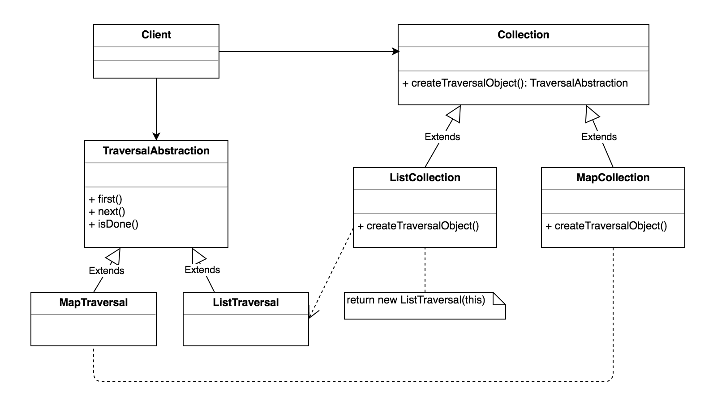

ITERATOR
--------

-Intent

    * Provide a way to access the elements of an aggregate object sequentially without
      exposing its underlying representation.
    * The C++ and Java standard library abstraction that makes it possible to decouple
      collection classes and algorithms.
    * Promote to 'full object status' the traversal of a collection.
    * Polymorphic traversal. 
    
-Problem

   Need to "abstract" the traversal of wildly different data structures so that 
   algorithms can be defined that are capable of interfacing with each transparently.
    
-Solution

   'An aggregate object such as a list should give you a way to access its elements
   without exposing its internal structure. Moreover, you might want to traverse the
   list in different ways, depending on what you need to accomplish. But you probably
   don'y want to  bloat the List interface with operations for different traversals,
   even if you could anticipate the ones you will require. You might also need to have
   more than one traversal pending on the same list'. And, providing a uniform interface
   for traversing many types of aggregate objects might be valuable. 
    
   The Iterator pattern lets you do all this. The key idea is to take the responsibility
   for access and traversal out of the aggregate object and put it into an Iterator
   object that defines a standard traversal protocol.
    
   The Iteraror abstraction is fundamental to an emerging technology called 'generic
   programming'. This strategy seeks to explicitly separate the notion of 'algorithm'
   from that of 'data structure'. The motivation is to: promote componet-based
   development, boost productivity, and reduce configuration management. 
    
   As an example, if you wanted to support four  data structures (array, binary, tree,
   linked list, and hash table) and three algorithms (sort, find, and merge),
   a traditional approach would require four times three permutations to develop and
   maintain. Whereas, generic programming approach would only require four plus three
   configuration items. 
   
UML Diagram
-----------
   
    