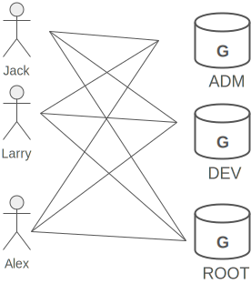
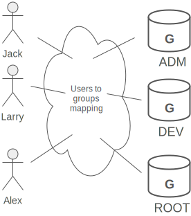
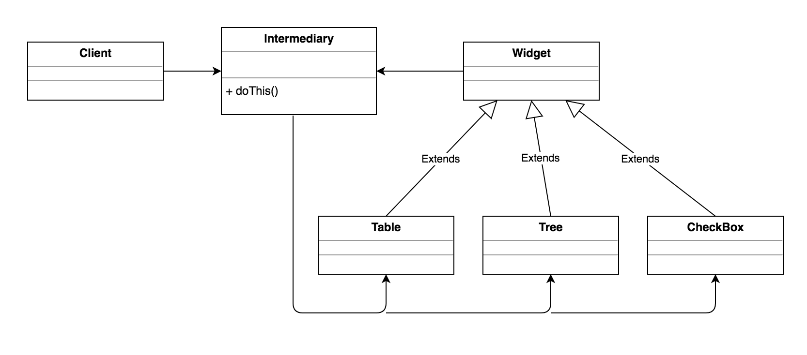

MEDIATOR
--------
    
-Intent
    
    * Define an object that encapsulates how a set of objects interact. Mediator 
      promotes loose coupling by keeping objects from referring to each other 
      explicitly, and it lets you vary their interaction independently.
    * Design an intermediary to decouple many peers.
    * Promote the many-to-many relationships between interacting peers 
      to "full object status".     
      
-Problem

   We want to design reusable components, but dependencies between the potentially
   reusable pieces demonstrates the "spaghetti code" phenomenon (trying to scoop 
   a single serving results in an "all or nothing clump"). 
    
-Solution

   In Unix, permission to access system resources is managed at three levels of 
   granularity: world, group, and owner. A group is a collection of users intended
   to model some functional affiliation. Each user on the system can be a member of
   one or more groups, and each group can have zero or more users assigned to it. 
   Next figure shows three users that are assigned to all three groups. 
          
    

   If we were to model this in software, we could decide to have User objects 
   coupled to Group objects, and Group objects coupled to User objects. Then when
   changes occur, both classes and all their instances would be affected.

   An alternate approach would be to introduce "an additional level of indirection"
   - take the mapping of users to groups and groups to users, and make it an abstraction
   unto itself. This offers several advantages: Users and Groups are decoupled from
   one another, many mappings can easily be maintained and manipulated simultaneously,
   and the mapping abstraction can be extended in the future by defining derived 
   classes.
    

   Partitioning a system into many objects generally enhances reusability, but 
   proliferating interconnections between those objects tend to reduce it again. 
   The mediator object: encapsulates all interconnections, acts as the hub of 
   communication, is responsible for controlling and coordinating the interactions 
   of its clients, and promotes loose coupling by keeping objects from referring to
   each other explicitly.    
    
   The Mediator pattern promotes a "many-to-many relationship network" to "full 
   object status". Modelling the inter-relationships with an object enhances 
   encapsulation, and allows the behavior of those inter-relationships to be 
   modified or extended through subclassing.
    
   An example where Mediator is useful is the design of a user and group capability
   in an operating system. A group can have zero or more users, and, a user can be 
   a member of zero or more groups. The Mediator pattern provides a flexible and 
   non-invasive way to associate and manage users and groups.
   
   
UML Diagram
-----------
   
    
    

