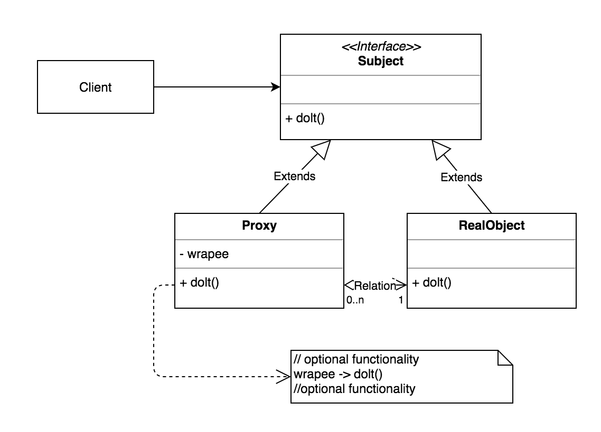

PROXY
-----
    
-Intent

    * Provide a surrogate or placeholder for another object to control access to it.
    * Use an extra level of indirection to support distributed, controlled, or intelligent access.
    * Add a wrapper and delegation to protect the real component from undue complexity.

-Problem

   You need to support resource-hungry objects, and you do not want to instantiate 
   such objects unless and until they are actually requested by the client.
    
-Solution

   Design a surrogate, or proxy, object that: instantiates the real object the 
   first time the client makes a request of the proxy, remembers the identity of 
   this real object, and forwards the instigating request to this real object. 
   Then all subsequent requests are simply forwarded directly to the encapsulated 
   real object. 

There are four common situations in which the Proxy pattern is applicable.

    * A virtual proxy is a placeholder for "expensive to create" objects. 
      The real object is only created when a client first requests/accesses the object.
    * A remote proxy provides a local representative for an object that resides in
      a different address space. This is what the "stub" code in RPC and CORBA provides.
    * A protective proxy controls access to a sensitive master object. The "surrogate"
      object checks that the caller has the access permissions required prior to forwarding
      the request.   
    * A smart proxy interposes additional actions when an object is accessed. 
      Typical uses include:   
      
        - Counting the number of references to the real object so that it can be freed
          automatically when there are no more references (aka smart pointer)
        - Loading a persistent object into memory when it's first referenced
        - Checking that the real object is locked before it is accessed to ensure that
          no other object can change it.

UML Diagram
-----------
  

      
