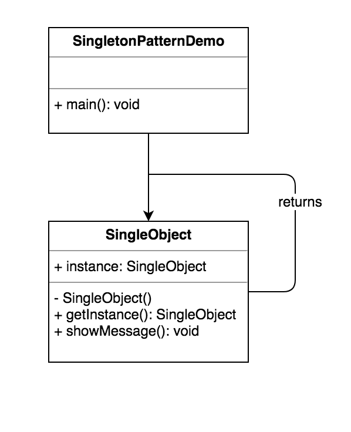

SINGLETON
---------
    
-Intent

    * Ensure a class has only one instance, and provide a global points of access to it
    * Encapsulated 'just-in-time initialization' or 'initialization on first use'
    
-Problem

   Application needs one, and only one, instance of an object. Additionally,
   lazy initialization and global access are necessary.  
      
-Solution

   Make the class of the single instance object responsible for creation, 
   initialization, access, and enforcement. Declare the instance as a private 
   static data member. Provide a public static member function that encapsulates 
   all initialization code, and provides access to the instance.
    
   The client calls the accessor function (using the class name and scope resolution
   operator) whenever a reference to the single instance is required.
    
   Singleton should be considered only if all three of the following criteria are 
   satisfied:
    
    - Ownership of the single instance cannot be reasonably assigned
    - Lazy initialization is desirable
    - Global access is not otherwise provided for
    - If ownership of the single instance, when and how initialization occurs, and 
    global access are not issues, Singleton is not sufficiently interesting.
    
   The Singleton pattern can be extended to support access to an application-specific
   number of instances.
    
   The "static member function accessor" approach will not support subclassing of 
   the Singleton class. If subclassing is desired, refer to the discussion in the 
   book.   
   
UML Diagram
-----------
      