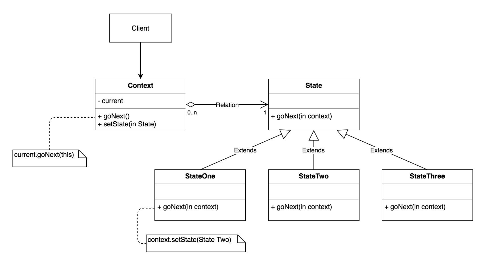

STATE
-----
    
-Intent

    * Allow an object to alter its behavior when its internal state changes. 
      The object will appear to change its class.
    * An object-oriented state machine
    * wrapper + polymorphic wrappee + collaboration 
    
-Problem

   A monolithic object's behavior is a function of its state, and it must change 
   its behavior at run-time depending on that state. Or, an application is characterized 
   by large and numerous case statements that vector flow of control based on the 
   state of the application.       
    
-Solution

   The State pattern is a solution to the problem of how to make behavior depend on 
   state.
    
    - Define a "context" class to present a single interface to the outside world.
    - Define a State abstract base class.
    - Represent the different "states" of the state machine as derived classes of 
      the State base class.
    - Define state-specific behavior in the appropriate State derived classes.
    - Maintain a pointer to the current "state" in the "context" class.
    - To change the state of the state machine, change the current "state" pointer.
    
   The State pattern does not specify where the state transitions will be defined. 
   The choices are two: the "context" object, or each individual State derived class.
   The advantage of the latter option is ease of adding new State derived classes. 
   The disadvantage is each State derived class has knowledge of (coupling to) its 
   siblings, which introduces dependencies between subclasses.
    
   A table-driven approach to designing finite state machines does a good job of 
   specifying state transitions, but it is difficult to add actions to accompany 
   the state transitions. The pattern-based approach uses code (instead of data 
   structures) to specify state transitions, but it does a good job of accommodating
   state transition actions.    
   
   
UML Diagram
-----------
   