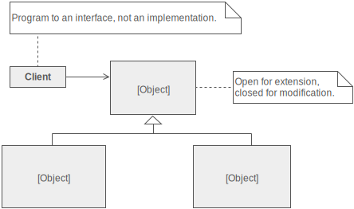

    STRATEGY
    
-Intent
    
    * Define a family of algorithms, encapsulate each one, and make them interchangeable. 
      Strategy lets the algorithm vary independently from the clients that use it.
    * Capture the abstraction in an interface, bury implementation details in derived classes.

-Problem & Solution

    One of the dominant strategies of object-oriented design is the "open-closed principle".
    
    Figure demonstrates how this is routinely achieved - encapsulate interface details
    in a base class, and bury implementation details in derived classes. Clients can then 
    couple themselves to an interface, and not have to experience the upheaval associated
    with change: no impact when the number of derived classes changes, and no impact when 
    the implementation of a derived class changes.
    
    
    
    A generic value of the software community for years has been, "maximize cohesion 
    and minimize coupling". The object-oriented design approach shown in figure is all 
    about minimizing coupling. Since the client is coupled only to an abstraction 
    (i.e. a useful fiction), and not a particular realization of that abstraction, the 
    client could be said to be practicing "abstract coupling" . an object-oriented variant 
    of the more generic exhortation "minimize coupling".
    
    A more popular characterization of this "abstract coupling" principle is "Program to 
    an interface, not an implementation".
    
    Clients should prefer the "additional level of indirection" that an interface 
    (or an abstract base class) affords. The interface captures the abstraction 
    (i.e. the "useful fiction") the client wants to exercise, and the implementations 
    of that interface are effectively hidden.
    

    

    

      
    