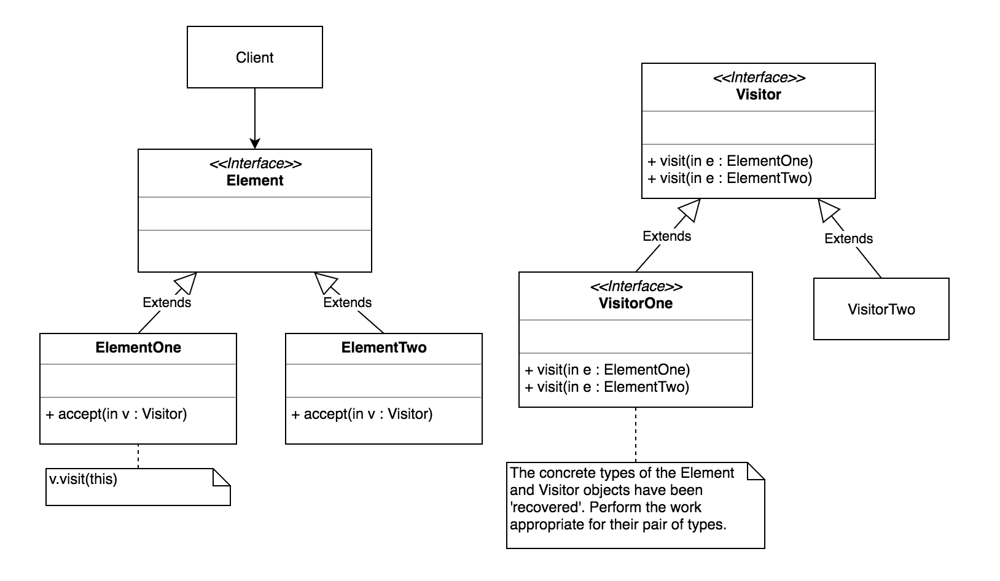

VISITOR
-------
    
-Intent

    * Represent an operation to be performed on the elements of an object structure.
      Visitor lets you define a new operation without changing the classes of the 
      elements on which it operates.
    * The classic technique for recovering lost type information.
    * Do the right thing based on the type of two objects.
    * Double dispatch

-Problem

   Many distinct and unrelated operations need to be performed on node objects in 
   a heterogeneous aggregate structure. You want to avoid "polluting" the node 
   classes with these operations. And, you don't want to have to query the type of 
   each node and cast the pointer to the correct type before performing the desired
   operation.  
    
-Solution

   Visitor's primary purpose is to abstract functionality that can be applied to 
   an aggregate hierarchy of "element" objects. The approach encourages designing 
   lightweight Element classes - because processing functionality is removed from 
   their list of responsibilities. New functionality can easily be added to the 
   original inheritance hierarchy by creating a new Visitor subclass.
    
   Visitor implements "double dispatch". OO messages routinely manifest "single 
   dispatch" - the operation that is executed depends on: the name of the request, 
   and the type of the receiver. In "double dispatch", the operation executed depends
   on: the name of the request, and the type of TWO receivers (the type of the 
   Visitor and the type of the element it visits).
    
   The implementation proceeds as follows. Create a Visitor class hierarchy that 
   defines a pure virtual visit() method in the abstract base class for each 
   concrete derived class in the aggregate node hierarchy. Each visit() method 
   accepts a single argument - a pointer or reference to an original Element derived
   class.
    
   Each operation to be supported is modelled with a concrete derived class of the 
   Visitor hierarchy. The visit() methods declared in the Visitor base class are now
   defined in each derived subclass by allocating the "type query and cast" code in 
   the original implementation to the appropriate overloaded visit() method.
    
   Add a single pure virtual accept() method to the base class of the Element 
   hierarchy. accept() is defined to receive a single argument - a pointer or 
   reference to the abstract base class of the Visitor hierarchy.
    
   Each concrete derived class of the Element hierarchy implements the accept() 
   method by simply calling the visit() method on the concrete derived instance of 
   the Visitor hierarchy that it was passed, passing its "this" pointer as the sole 
   argument.
    
   Everything for "elements" and "visitors" is now set-up. When the client needs 
   an operation to be performed, (s)he creates an instance of the Visitor object, 
   calls the accept() method on each Element object, and passes the Visitor object.
    
   The accept() method causes flow of control to find the correct Element subclass. 
   Then when the visit() method is invoked, flow of control is vectored to the 
   correct Visitor subclass.  accept() dispatch plus visit() dispatch equals double
   dispatch.
    
   The Visitor pattern makes adding new operations (or utilities) easy - simply add
   a new Visitor derived class. But, if the subclasses in the aggregate node hierarchy
   are not stable, keeping the Visitor subclasses in sync requires a prohibitive amount of effort.
    
   An acknowledged objection to the Visitor pattern is that is represents a regression
   to functional decomposition - separate the algorithms from the data structures. 
   While this is a legitimate interpretation, perhaps a better perspective/rationale
   is the goal of promoting non-traditional behavior to full object status. 
   
UML Diagram
-----------
      